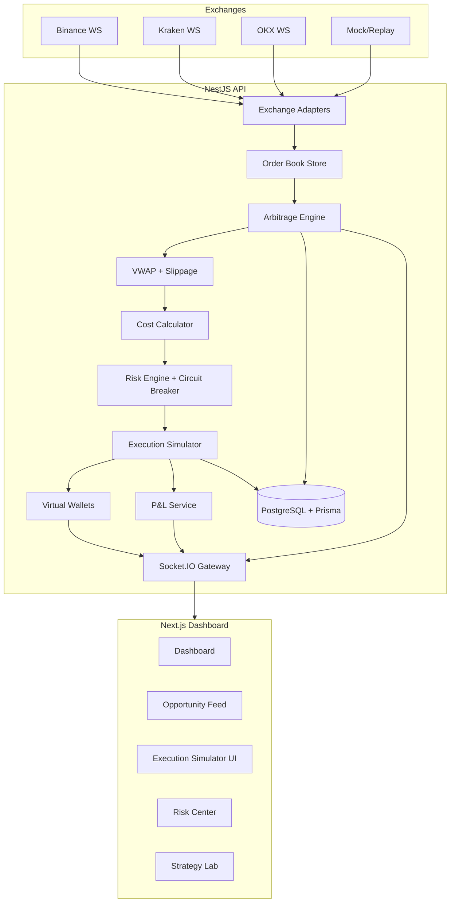

# Architecture

ArbiX is a TypeScript monorepo with a Next.js dashboard and a NestJS realtime backend.

## Backend Modules

- `market-data`: exchange adapters, symbol normalization and order book state.
- `arbitrage`: cross-exchange comparison, VWAP, cost calculation, scoring and triangular watch-only service.
- `risk`: latency checks, stale data protection and circuit breaker.
- `simulator`: virtual execution, partial fills, wallets and P&L.
- `analytics`: summaries for charts and replay scenario metadata.
- `realtime`: Socket.IO gateway and event publisher.
- `database`: Prisma service and schema.

## Realtime Events

Backend to frontend:

- `market.quote.updated`
- `market.orderbook.updated`
- `opportunity.detected`
- `opportunity.rejected`
- `opportunity.executed`
- `trade.simulated`
- `wallet.updated`
- `pnl.updated`
- `risk.circuit_breaker.triggered`
- `risk.circuit_breaker.cleared`
- `analytics.updated`
- `risk.status.updated`
- `opportunities.updated`
- `exchanges.status.updated`
- `latency.updated`
- `bot.status.updated`
- `replay.started`
- `replay.finished`

Frontend to backend:

- `bot.start`
- `bot.stop`
- `bot.pause`
- `bot.reset`
- `config.update`
- `wallet.reset`
- `replay.start`
- `replay.scenario`
- `latency.ack`

## Safety Model

ArbiX never executes real trades. It does not request private exchange keys. Every execution is simulated against normalized public or synthetic market data.
